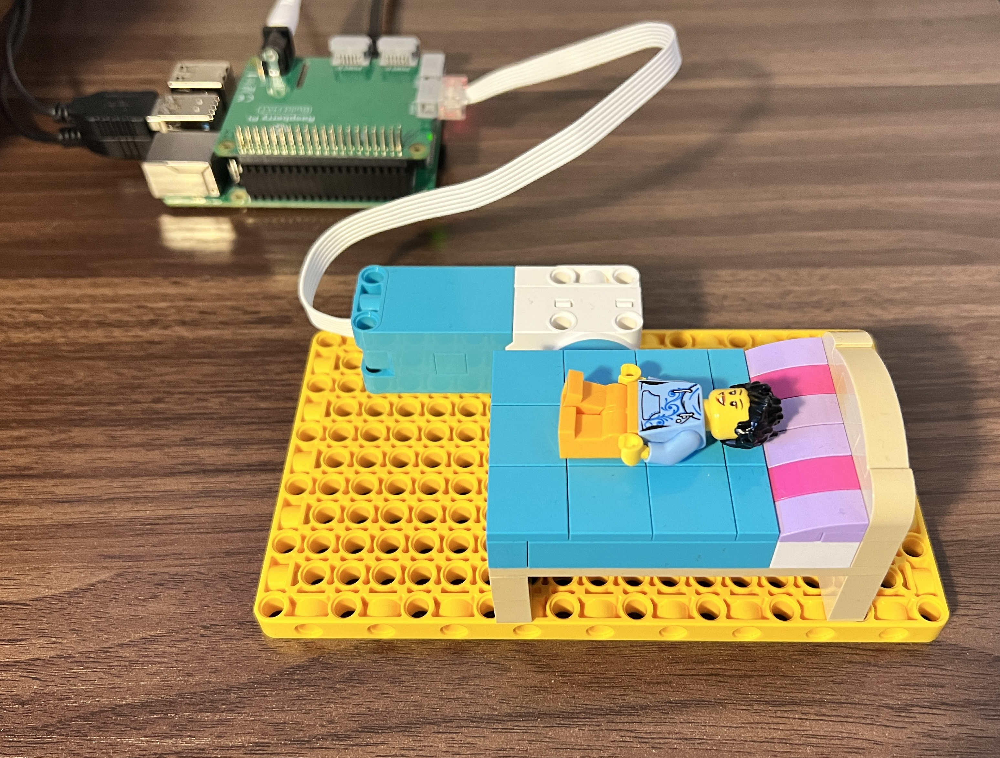

## Introduction

Using a Raspberry Pi Build HAT and LEGO® Technic™ motor, make a LEGO bed that tips up at sunrise to stop a minifigure sleeping through the day. 

The **Raspberry Pi Build HAT** fits on top of a Raspberry Pi Computer and can control up to four LEGO® Technic™ motors and sensors at the same time.

You will:
+ Connect a **Raspberry Pi Build HAT** to the **Raspberry Pi computer** and interact with a LEGO® build
+ Program a **LEGO® Technic™ motor** using the **Python buildhat library**
+ Use Python **time** objects to calculate differences and delay outputs

To complete this project you will need the following hardware:
+ A Raspberry Pi computer 
+ A Raspberry Pi Build HAT
+ A 7.5V power supply with a barrel jack
+ A LEGO® Technic™ motor
+ An assortment of LEGO® (from the LEGO® Education SPIKE™ Prime kit or other LEGO® sets)

--- no-print ---
--- task ---
### Get inspiration

  
This example shows a LEGO® daytime ejector bed in operation. Would you like to be woken by an ejector bed? Do you think that kind of wake up would be good or bad for your mental health?

--- /task ---
--- /no-print ---

--- print-only ---

--- /print-only ---