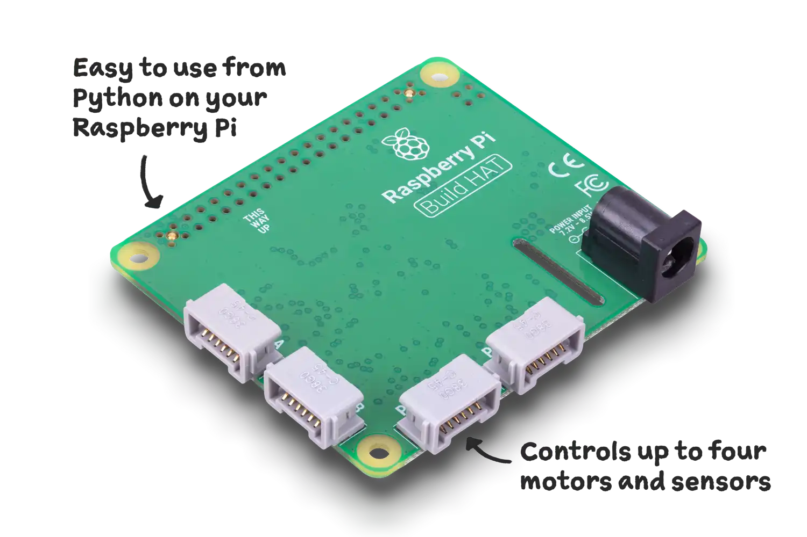

## Introduction

Use a Raspberry Pi Build HAT and LEGO® Technic™ motor to build a LEGO bed that tips up at sunrise stopping a LEGO minifigure sleeping through the day. 

The **Raspberry Pi Build HAT** fits on top of a Raspberry Pi Computer and can control up to four LEGO® Technic™ motors and sensors at the same time.
{:width="300px"}

You will:
+ Connect a **Raspberry Pi Build HAT** to interact with a LEGO® build
+ Program a **LEGO® Technic™ motor** using the Python buildhat library
+ Use Python time objects to calculate differences and delay outputs

### You will need

Hardware:
+ A Raspberry Pi computer 
+ A Raspberry Pi Build HAT
+ A 7.5V power supply with a barrel jack
+ A LEGO® Technic™ motor
+ An assortment of LEGO® (from the LEGO® Education SPIKE™ Prime kit or other LEGO® sets)

Software:
+ Python 3
+ The Build HAT Python library

You can follow our [Raspberry Pi Build HAT guide](https://projects.raspberrypi.org/en/projects/build-hat-guide){:target="_blank"} to set up your Raspberry Pi computer, connect the Raspberry Pi Build HAT and install the buildhat python library.

--- no-print ---
--- task ---
### Get inspiration

  
This example shows a LEGO® daytime ejector bed in operation. Would you like to be woken by an ejector bed? Do you think that kind of wake up would be good or bad for your mental health?

--- /task ---

Whilst we don't recommend using an ejector bed yourself, **a positive sleep routine** is good for your physical and mental health. Here are some tips to motivate you to get up (that don't involve catapulting!). Brighten up your room, turn on some music, or place your alarm clock out of reach.

--- /no-print ---

--- print-only ---

--- /print-only ---