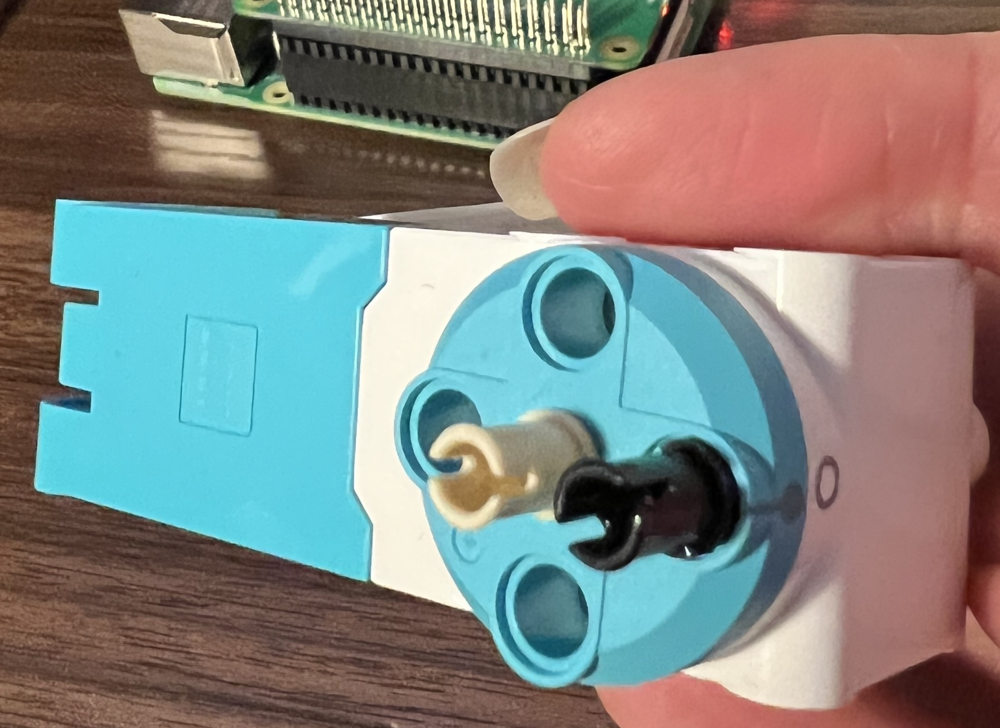
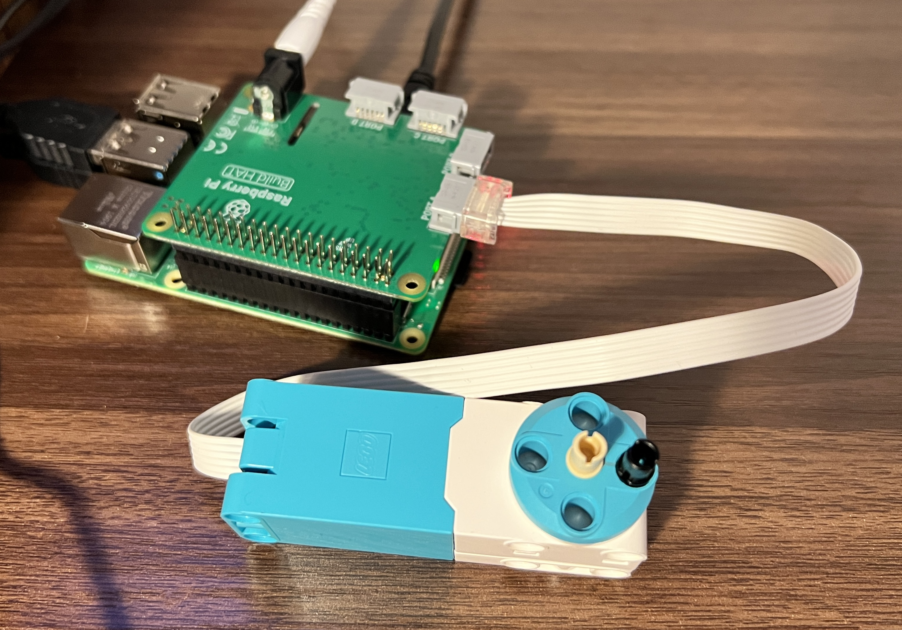
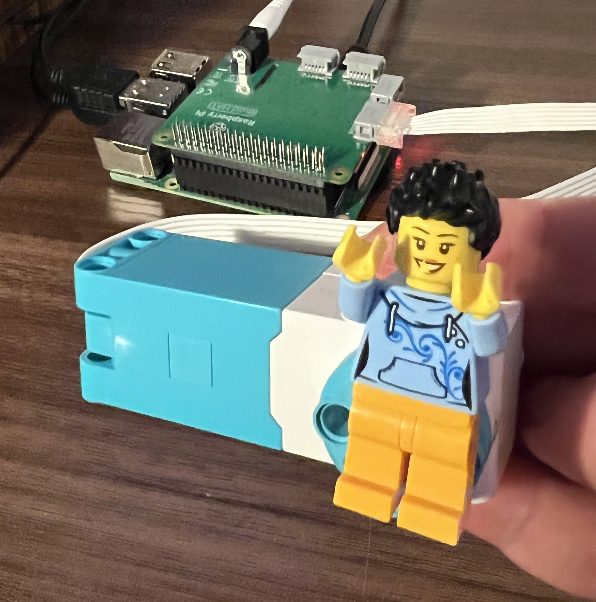

## Control the motor

When you connect a LEGO® Technic™ motor to your Raspberry Pi Build HAT you will be able to control the motor - and a spin a LEGO® minifigure round and round! 

{:width="300px"}

--- task ---

To connect a LEGO® minifigure to your LEGO® Technic™ motor you need to first add two LEGO® Pin Connectors: 

--- /task ---

--- task ---

Attach your LEGO® Technic™ motor to the Raspberry Pi Build HAT connector labelled 'Port A';

--- /task ---

--- task ---

Using the holes on the back of a LEGO® minifigure's legs, connect them to the two pin connectors:

--- /task ---

--- task ---

Add code to `import Motor` from the `buildhat` library then initialise the Motor on port 'A' of the Raspberry Pi Build HAT.

Use the `run_for_rotations()` function to spin your motor `3` times at a speed of `20`:

--- code ---
---
language: python
filename: wakeup.py
line_numbers: true
line_number_start: 1
line_highlights: 1-6
---
from buildhat import Motor

# Initialise the Motor on port A
motor = Motor('A') 

motor.run_for_rotations(3, 20) 

--- /code ---

--- /task ---

--- task ---

**Test:** Save your project as `wakeup.py` then run your code. The minifigure will rotate slowly in a full circle 3 times.

--- /task ---

--- task ---

Comment out your `motor.run_for_rotations(3, 20)` code by inserting a `#` at the start of the line. 

Add a new line of code to spin your motor for `5` seconds at `40` speed:

--- code ---
---
language: python
filename: wakeup.py
line_numbers: true
line_number_start: 1
line_highlights: 6-7
---
from buildhat import Motor

# Initialise the Motor on port A
motor = Motor('A') 

# motor.run_for_rotations(3, 20)
motor.run_for_seconds(5, 40) 

--- /code ---

--- /task ---

--- task ---

**Test:** Run your code again. The minifigure will now spin for longer at a faster speed. 

--- /task ---

--- task ---

Comment out your `motor.run_for_seconds(5, 40)` code then add code to run for `3600` degrees at a speed of `90`:

--- code ---
---
language: python
filename: wakeup.py
line_numbers: true
line_number_start: 1
line_highlights: 7-8
---
from buildhat import Motor

# Initialise the Motor on port A
motor = Motor('A') 

# motor.run_for_rotations(3, 20)
# motor.run_for_seconds(5, 40)
motor.run_for_degrees(3600, 90)  

--- /code ---

--- /task ---

--- task ---

**Test:** Run your code again. The minifigure will quickly spin `3600` degrees (10 full rotations). 

--- /task ---

--- task ---

**Test:** Uncomment your code and experiment with the numbers in the functions. 

+ What happens if you use a negative number of rotations or degrees? 
+ Try different speeds between `-100` and `100`, what is the output? 

--- /task ---

--- save ---